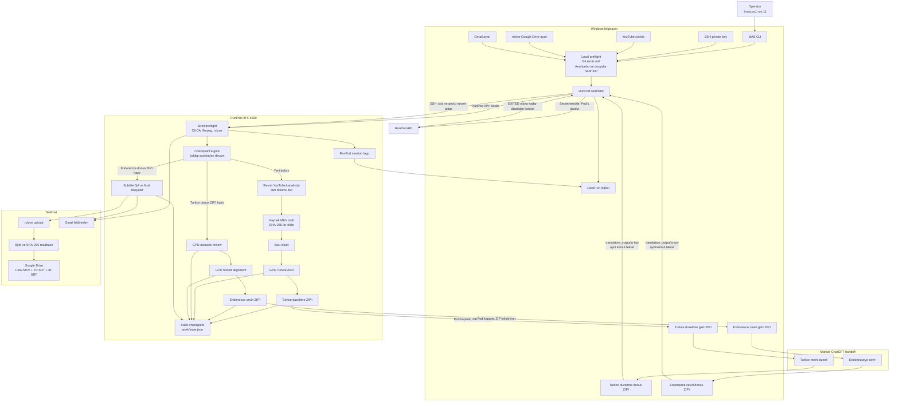

# Güncel mimari: EP14+ delivery-first

Son güncelleme: 18 Eylül 2026. [Hazırlık ve recovery sözleşmesi](EP14_READY_2026-09-18.md).
Aşağıdaki eski strict şema EP14 varsayılan giriş yolu değildir.

```text
Windows controller: doctor --controller -> run 14
  -> resmi kaynak kimliği ve değişmez video/audio
  -> sınırlı RunPod lease, GPU primary ASR
  -> sınırlı boşluk recovery ve isteğe bağlı CTC
  -> gerçek Endonezce dönüşü için part handoff
  -> export indirilir, owned Pod yokluğu dışarıdan doğrulanır
  -> yerel QSV encode ve imzalı doğrulama
       part-001: Drive upload + byte/SHA readback + publication ACK
       sonraki:  LOCAL_ENCODED_NOT_PUBLISHED + ayrı local-tail ACK
  -> bütün sample aralıklarını bir kez kapsayan full stream-copy MP4
  -> full Drive upload + byte/SHA readback
  -> DELIVERED_WITH_WARNINGS, NOT_STRICT, perceptual NOT_ASSERTED
```

Yeni bir kaynak edinimi veya encoding sonucu yalnızca dosya var diye kabul edilmez.
Hata cleanup'ı yeni iş preflight'ından bağımsızdır; orijinal iş bütçesini uzatmaz.
Sahipliği veya dış kapatması doğrulanamayan Pod için yeniden başlatma önerilmez.
`status 14` imzalı küçük yerel kayıtları gösterir; canlı Drive/Pod doğrulaması değildir.
Kalite uyarıları ve boş altyazı açıkça gösterilir, strict PASS'e çevrilmez.

# Tarihsel strict mimari: EP11/12/13



## Parcalar ne yapiyor?

| Parca | Basit gorevi |
|---|---|
| `mas.ps1` | Senin verdigin tek komutu calistirir. |
| Local preflight | Para harcamadan once eksik ayar var mi kontrol eder. |
| RunPod API | GPU bilgisayari acar ve kapatir. |
| SSH | Kodumuzu ve komutlari RunPod bilgisayarina guvenli tasir. |
| Checkpoint | Tamamlanan asamalari kaydeder; tekrar calistirinca bastan baslamaz. |
| ChatGPT handoff | Turkce duzeltme ve Endonezce ceviri icin iki manuel ZIP gecisidir. |
| rclone | Sadece final MKV, TR SRT ve ID SRT dosyalarini Drive'a yollar. |
| Readback | Drive'daki dosyayi geri okuyup byte ve SHA-256 degerlerini dogrular. |
| Gmail | Baslangic, asama, hata, bekleme ve tamamlanma bildirimlerini yollar. |
| Loglar | Hatalari, ciktilari ve gecen sureleri yerelde saklar. |

## Bir bolumun normal akisi

1. `.\mas.ps1 run 11` calistirilir.
2. Pod otomatik acilir ve GPU islemleri baslar.
3. Turkce duzeltme ZIP'i yerel bilgisayara indirilir; Pod kapanir.
4. ZIP ChatGPT'ye verilir, donen ZIP belirtilen `translation_output` klasorune konur.
5. `.\mas.ps1 run 11` tekrar calistirilir ve kaldigi yerden devam eder.
6. Endonezce ceviri ZIP'i icin ayni handoff bir kez daha yapilir.
7. Ayni komut son kez calistirilir.
8. Final MKV, TR SRT ve ID SRT Drive'a yuklenip geri okunarak dogrulanir.
9. Tamamlanma e-postasi gelir ve Pod'un `EXITED` oldugu disaridan dogrulanir.

Episode 12 korunmustur. Ilk gercek test adayi Episode 11'dir.
